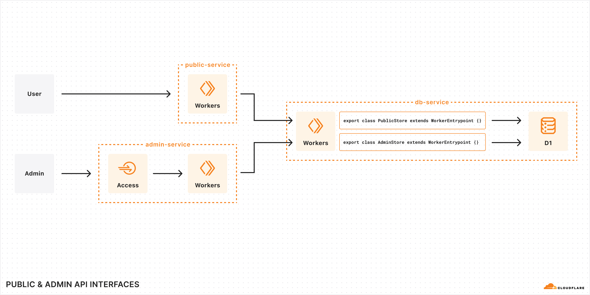
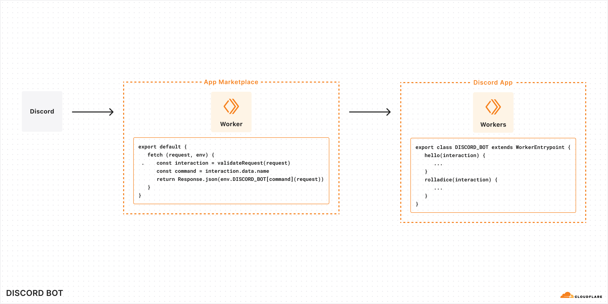

# JavaScript-native RPC on Cloudflare Workers <> Named Entrypoints — Demos

This is a collection of examples of communicating between multiple Cloudflare Workers using the [remote-procedure call (RPC) system](https://developers.cloudflare.com/workers/runtime-apis/rpc) that is built into the Workers runtime.

Specifically, these examples highight patterns for how to expose multiple [named entrypoints](https://developers.cloudflare.com/workers/runtime-apis/bindings/service-bindings/rpc/#named-entrypoints) from a single Cloudflare Worker, and bind directly to them using [Service bindings](https://developers.cloudflare.com/workers/runtime-apis/bindings/service-bindings/rpc/).

## Demos

1. [Public & Admin API Interfaces](./public-admin-api-interfaces/README.md)

   This is a comprehensive "to do" application example. It is composed of three different services, a D1 database, two web applications (one protected by Cloudflare Access), and two different Worker Entrypoints for different user role permission levels.

   

1. [Discord Bot](./discord-bot/README.md)

   

   This is a Discord bot, written as a Worker Entrypoint. It sketches a possible future where application integrations could be written as Worker Entrypoints, without needing to worry about boilerplate like routing or authentication (and instead, just with simple JavaScript hook-like functionality).

Learn more about the RPC system in Cloudflare Workers by reading the [blog post](https://blog.cloudflare.com/javascript-native-rpc).

## Getting started

1. Clone this repository: `git clone https://github.com/cloudflare/js-rpc-and-entrypoints-demo.git && cd js-rpc-and-entrypoints-demo`
1. `npm install` in the root of this monorepo.
1. `cd` into one of the applications, and open its `README.md` to learn more.

## Documentation

- [RPC](https://developers.cloudflare.com/workers/runtime-apis/rpc)
- [Named entrypoints](https://developers.cloudflare.com/workers/runtime-apis/bindings/service-bindings/rpc/#named-entrypoints)
- [Service bindings](https://developers.cloudflare.com/workers/runtime-apis/bindings/service-bindings/rpc/)
