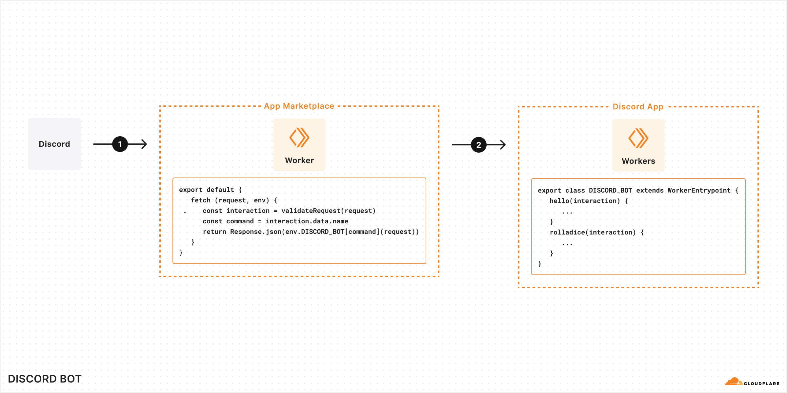

# Discord Bot demo

This is a Discord bot, written as a Worker Entrypoint. It sketches a possible future where application integrations could be written as Worker Entrypoints, without needing to worry about boilerplate like routing or authentication (and instead, just with simple JavaScript hook-like functionality).

## Getting started

1. Follow the instructions in the [README.md in the root of this monorepo](../README.md).
1. [Create a Discord app](https://discord.com/developers/docs/quick-start/getting-started), authenticate with it for your server, and copy the `DISCORD_TOKEN`, `APP_ID`, and `PUBLIC_KEY` into [`.dev.vars`](./.dev.vars) (see the [`.dev.vars.example`](./.dev.vars.example) file for an example).
1. Register the app's commands by running `npm run register`.
1. Deploy the bot to Cloudflare with `npm run deploy`.
1. Copy the deployment URL (`https://discord-bot.<subdomain>.workers.dev/`) into the "Interactions endpoint URL" field in the Discord app's settings, and click "Save changes". This will validate the app is running correctly.

## System Design

- `discord-bot` is a Worker service which demonstrates a future where there is no longer any need for boilerplate such as routing or authentication when creating an application integration such as a Discord bot.



1. A request from Discord hits Cloudflare's hypothetical new "App Marketplace". Discord and Cloudflare maintain this relationship. Cloudflare parses the request and validates its authenticity before invoking the user's Discord App" service over RPC.
2. The Discord app integration passes along the Discord interaction payload directly to the appropriate command function in the user-defined Worker Entrypoint. The user only needs to implement these command functions. They return an interaction response, which the app integration then serializes and sends back to Discord in reply.

---

In reality, since this app marketplace doesn't actually exist today, we've bound to this entrypoint from it's own service which defines a typical `fetch` handler and does implement this validation/parsing work for us.

---

## Attribution

This demo is adapted from [the official Discord example app](https://github.com/discord/discord-example-app).

```
MIT License

Copyright (c) 2022 Shay DeWael

Permission is hereby granted, free of charge, to any person obtaining a copy
of this software and associated documentation files (the "Software"), to deal
in the Software without restriction, including without limitation the rights
to use, copy, modify, merge, publish, distribute, sublicense, and/or sell
copies of the Software, and to permit persons to whom the Software is
furnished to do so, subject to the following conditions:

The above copyright notice and this permission notice shall be included in all
copies or substantial portions of the Software.

THE SOFTWARE IS PROVIDED "AS IS", WITHOUT WARRANTY OF ANY KIND, EXPRESS OR
IMPLIED, INCLUDING BUT NOT LIMITED TO THE WARRANTIES OF MERCHANTABILITY,
FITNESS FOR A PARTICULAR PURPOSE AND NONINFRINGEMENT. IN NO EVENT SHALL THE
AUTHORS OR COPYRIGHT HOLDERS BE LIABLE FOR ANY CLAIM, DAMAGES OR OTHER
LIABILITY, WHETHER IN AN ACTION OF CONTRACT, TORT OR OTHERWISE, ARISING FROM,
OUT OF OR IN CONNECTION WITH THE SOFTWARE OR THE USE OR OTHER DEALINGS IN THE
SOFTWARE.
```
