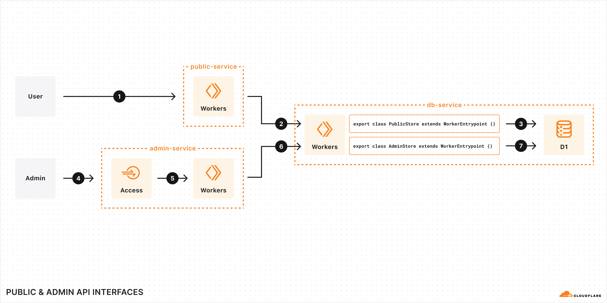

# Public & Admin API Interfaces demo

This is a comprehensive "to do" application example. It is composed of three different services, a D1 database, two web applications (one protected by Cloudflare Access), and two different Worker Entrypoints for different user role permission levels.

## Live demo

[https://public-service.gregbrimble.workers.dev/](https://public-service.gregbrimble.workers.dev/)

## Getting started

1. Follow the instructions in the [README.md in the root of this monorepo](../README.md).
1. `npm run dev`. This will take a few seconds to spin up all three services.
1. Open the [`public-service` (http://localhost:9000/)](http://localhost:9000/) and [`admin-service` (http://localhost:9001/)](http://localhost:9001/) applications in your browser.

To deploy:

1. Create a D1 database `npx wrangler d1 create todo-app` and open the `./db-service/wrangler.toml` file and change the `DB` binding's `database_id` to your own.
1. `npm run deploy`.

## System Design

- [`db-service`](./db-service/) is a Worker which has access to a D1 database, and exposes two different entrypoints: `PublicStore` and `AdminStore`. These stores expose different functions, appropriate for their associated access level. For example, `PublicStore` exposes an innocuous `countAllTasks()` function, and `AdminStore` exposes a mutating `deleteAllTasks()` function. The D1 database can only be queried with code owned by the `db-service` Worker, since the binding is only present in the `db-service` Worker's [`wrangler.toml` file](./db-service/wrangler.toml).

- [`public-service`](./public-service/) is a Worker which hosts our SaaS application dashboard. `public-service` has two webpages, `/` and `/user/<username>/`. The `/` page has a simplified login form, and the `/user/<username>/` page shows the user's tasks and allows the user to toggle the status of those tasks and add new ones. `public-service` has a Service binding to `db-service`'s `PublicStore` entrypoint. This allows the `public-service` to requesting an `AuthedStore` (a class extending `RpcTarget`) from the `PublicStore` for the given user. This `AuthedStore` has context on who this user is, and can only access that particular user's information.

- [`admin-service`](./admin-service/) is a Worker (hypothetically protected by Cloudflare Access). It has a binding to `db-service`'s `AdminStore` entrypoint, which grants it access to administrative functions like `deleteAllTasks()`, `deleteAllUsers()`, and `deleteAllCompletedTasks()`.

1. A request from the open internet to the `public-service` is made.
2. The `public-service` makes an RPC request to `db-service`'s `PublicStore` entrypoint. The binding is configured in [`public-service`'s `wrangler.toml` file](./public-service/wrangler.toml).
3. `db-service`'s `PublicStore` can interface directly with the D1 database (or return an `AuthedStore` to `public-service` which can).
4. A request from the open internet to the `admin-service` is made, but is intercepted by Cloudflare Access.
5. If Cloudflare Access allows the request through, it hits the `admin-service` which validates the Cloudflare Access JWT.
6. The `admin-service` makes an RPC request to `db-service`'s `AdminStore` entrypoint. The binding is configured in [`admin-service`'s `wrangler.toml` file](./admin-service/wrangler.toml).
7. `db-service`'s `AdminStore` can interface directly with the D1 database.

Not only does this design showcase how to design a secure system using entrypoints as a mechanism to gate role-based access control within your application, but it also shows how you might separate out ownership of a complex application across various development teams. For example, `public-service` might be developed by a team of frontend-focused developers, whereas `db-service` and the queries within might be maintained by database experts.
